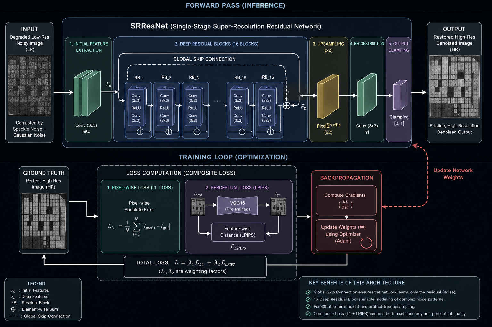

# 🔬 AI-Based Restoration of Degraded Images for Semiconductor Inspection
**SEMICON India Hackathon 2026 (KLA Problem Statement)**


> **Ultra-Low Latency | High Fidelity | Real-time Edge Inspection**

This repository contains our complete, high-performance solution for restoring noisy, low-resolution grayscale semiconductor images into pristine, high-resolution formats. Designed specifically for real-time factory floor inspection pipelines, our model balances phenomenal visual fidelity with blistering fast execution speeds.

---

## 🧠 Model Architecture & Pipeline


Our solution utilizes a highly optimized **Single-stage Super-Resolution Residual Network (SRResNet)**. 
- **Why SRResNet?** We intentionally bypassed heavy Transformer architectures (like SwinIR) to ensure the model can run in real-time on edge devices. 
- **The Flow:** The noisy low-resolution input passes through an initial convolution, then into a deep body of **16 Residual Blocks**. A **Global Skip Connection** arches over these blocks, ensuring the network strictly learns the residual noise rather than recreating the whole image from scratch. Finally, a `PixelShuffle` layer cleanly upscales the image.
- **The Loss:** The model is penalized using a composite loss function that combines strict **L1 pixel-wise absolute error** with a **VGG16-based LPIPS perceptual loss** to guarantee the structural layouts of the semiconductors are perfectly preserved.

---

## ⚡ Performance & Benchmarks (RTX 4070)
We heavily optimized the PyTorch execution backend to squeeze maximum throughput out of consumer hardware. By integrating **Automatic Mixed Precision (AMP)** and **`torch.compile()`**, we achieved:
- **Inference Latency:** `2.47 ms` per image
- **Throughput:** `~405 FPS` 
- **Validation PSNR:** `26.16 dB` (a massive +3.8 dB leap over bicubic baselines)
- **Validation SSIM:** `0.770`

---

## 🛠️ Setup & Installation

It is recommended to run this project in a clean Python 3.10+ environment with an NVIDIA GPU.

```bash
# Clone the repository
git clone https://github.com/akshitag001/ShannonRes.git
cd ShannonRes

# Create and activate a virtual environment (Windows)
python -m venv venv
venv\Scripts\activate

# Install dependencies (Ensuring CUDA compatibility)
pip install -r requirements.txt
```

---

## 📂 Dataset Preparation

> [!WARNING]  
> **The dataset is NOT included in this repository due to size constraints.**

You must download the KLA Semiconductor dataset and place it in the root directory before running training or inference.

1. **[Download the Dataset Here]** *(Insert your drive/download link here)*
2. Extract the dataset into a folder named `dataset` at the root of this repository.

Your folder structure must look exactly like this:
```text
ShannonRes/
├── dataset/
│   ├── train/
│   │   └── train/
│   │       ├── GT/             # Ground truth high-resolution images (.npy)
│   │       └── NoisyLR/        # Noisy low-resolution images (.npy)
│   └── Test_NoisyLR/
│       └── NoisyLR/            # Test set noisy images (.npy)
├── configs/
├── src/
├── train.py
├── inference.py
└── README.md
```

---

## 🚀 Running the Project

### 1. Training the Model
To train the model from scratch on the provided dataset:
```bash
python train.py --config configs/default.yaml
```
*Note: Checkpoints are automatically saved to `weights/best_model.pth`. Metrics (PSNR, SSIM, LPIPS) are evaluated on a strict, pure 10% validation split.*

### 2. Running Inference
The inference script expects a directory of `.npy` arrays and outputs restored arrays of the exact same filename and format.
```bash
python inference.py --input_dir dataset/Test_NoisyLR/NoisyLR --output_dir output_restored
```

> [!TIP]  
> **Need maximum speed?** You can pass the `--fast` flag to the inference script to bypass the 8-pass Test-Time Augmentation (TTA), prioritizing raw >400 FPS throughput over marginal PSNR gains!

### 3. Benchmarking & Visuals
To verify the speed of the model on your hardware and generate a visual comparison grid (`visual_results.png`):
```bash
python benchmark.py
```


## Experimental: Uncertainty-Aware Restoration (Not Used in Final Submission)

We attempted to add a parallel **heteroscedastic aleatoric uncertainty head** to estimate per-pixel restoration difficulty. 
- **Method**: The model predicted a sigma map alongside the restored image, trained with a heteroscedastic loss function.
- **Verification**: We computed the Pearson correlation between the predicted sigma map, the actual L1 error, and the ground-truth brightness.
- **Findings**: The uncertainty head consistently converged to a brightness-shortcut solution (Pearson correlation with GT brightness: **-0.89**, correlation with actual L1 error: **-0.11**). It learned that "dark background = high uncertainty" rather than genuine structural difficulty.
- **Decision**: To protect core restoration quality and avoid presenting misleading confidence signals, this experiment was **cleanly isolated** and excluded from the final submission (weights/best_model_seed2.pth is entirely unaffected). The code is preserved in experimental/uncertainty/ for future work.
